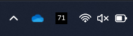

# Battery Lamp

A Python project to add a battery status icon to the system tray on your Windows device.

**Preview**  

## Motivation

'Battery Lamp' was created out of the need to have an effortless and clear view of my device’s exact battery percentage directly on the taskbar. Windows doesn't provide this information without an extra click and only shows a vague icon. By having 'Battery Lamp' update the battery status in real-time, it ensures that I know precisely when to plug in my charger and avoid the stress of surprise low battery notifications.

## How to Use Battery Lamp

**Requirements:** 
- Operating System: **Windows 10 or 11**.
- [Python 3](https://www.python.org/downloads/windows/) installed on the system.

*It is recommended to install Python with version 3.9 or higher. Python 3.8 and older version have reached their end of life.*

**Execution Steps:**

1. Clone the project or download `battery_percentage.pyw` from the src directory.

2. Install the dependencies mentioned in the `requirements.txt` file.

3. Execute the script using a Command Prompt or PowerShell instance with the command `pythonw battery_percentage.pyw` .

> [!NOTE]  
> The 'w' in `pythonw` is crucial as it ensures the script runs without keeping the console busy. In other words, you can continue using the terminal after you ran the above command or close it, the lamp will run in the background.

**Result:**

If all the above steps are completed correctly, a new icon will appear in the system tray displaying the battery percentage.

> [!TIP]  
> You might need to pin the icon to the taskbar by dragging it out from the hidden icons list in the system tray panel.  
> 

**Closing the Program:**

Right-clicking on the icon will display a context menu with an "Exit" option. Clicking "Exit" will close the program.

## Preview

Here are different ways the Battery Lamp will glow under different battery status conditions.

|              |Not Charging|Charging|
|--------------|------------|--------|
|Charge at 100%|||
|Charge at 71% |||
|Charge at 15%^|||

> *^ Below critical charge threshold of 20%, later versions should provide an option to change this threshold.*

## Roadmap

Here are some exciting features being considered for future versions, ordered by complexity of implementation:

1. Ability to set custom critical battery threshold.
2. Customizable update frequency for battery status checks.
3. More themes.
4. Themes customiser and preview UI.
5. More options in the context menu.
6. Quick access settings from the system tray.
7. Detailed battery health statistics report exports.
8. Graphical dashboard for detailed statistics.
9. Actions server.
